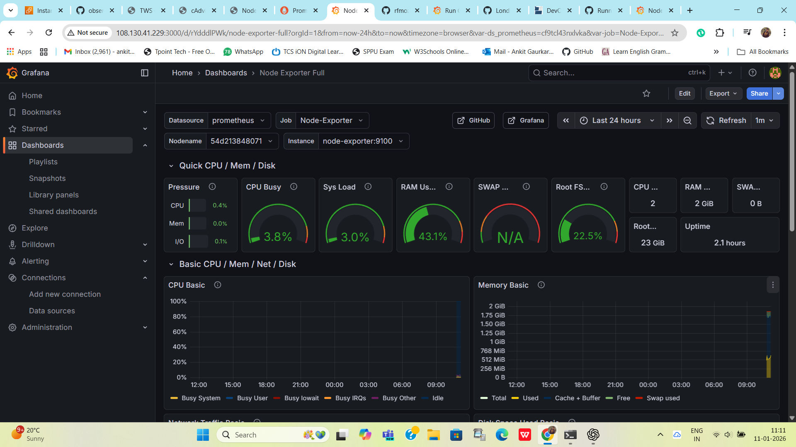

📊 Observability-For-DevOps

A hands-on DevOps Observability project using Docker, Docker Compose v2, Prometheus, Grafana, cAdvisor, Redis, and Node Exporter, with a sample Notes Application to demonstrate real-world monitoring.

This project helps you understand how infrastructure and applications are monitored in production environments.

for local to EC2 image copy:-
scp -i observability-key.pem "/mnt/c/Users/prash/OneDrive/Pictures/Screenshots/Screenshot 2026-01-11 111121.png" ubuntu@108.130.41.229:/home/
ubuntu/observability-for-devops/

                 +------------------+
                 |   Grafana UI     |
                 |  (Dashboards)   |
                 +--------+---------+
                          |
                          v
                 +------------------+
                 |   Prometheus     |
                 |  (Metrics DB)   |
                 +--------+---------+
                          |
     -------------------------------------------------
     |                     |                        |
     v                     v                        v
+-----------+     +----------------+        +---------------+
| Node Exp. |     |   cAdvisor     |        |  Notes App    |
| (Host)    |     | (Containers)  |        |  (Django)    |
+-----------+     +----------------+        +---------------+
                          |
                     +-----------+
                     |  Redis    |
                     +-----------+

| Component             | Purpose                       |
| --------------------- | ----------------------------- |
| **Docker**            | Containerization              |
| **Docker Compose v2** | Multi-container orchestration |
| **Prometheus**        | Metrics collection            |
| **Grafana**           | Visualization & dashboards    |
| **cAdvisor**          | Container-level metrics       |
| **Node Exporter**     | Host-level metrics            |
| **Redis**             | Dependency service            |
| **Django Notes App**  | Sample application            |

observability-for-devops/
├── docker-compose.yml
├── prometheus.yml
├── notes-app/
│   ├── Dockerfile
│   ├── manage.py
│   ├── requirements.txt
│   └── ...
├── assets/
│   └── images/
│       └── grafana-dashboard.png
└── README.md

⚙️ Prerequisites

Ubuntu 20.04 / 22.04 / 24.04

Docker installed

Docker Compose v2 (plugin-based)

Verify installation:
docker --version
docker compose version

🧩 Setup & Installation
1️⃣ Clone the repository
git clone https://github.com/AnkitGaurkar/observability-for-devops.git
cd observability-for-devops

2️⃣ Add user to Docker group (recommended)
sudo usermod -aG docker $USER
newgrp docker

3️⃣ Start the Observability Stack
docker compose up -d

4️⃣ Verify running containers
docker ps

Expected containers:

notes-app

prometheus

grafana

cadvisor

node-exporter

redis

🌐 Access URLs
Service	URL
Notes App	http://<EC2-IP>:8000
Prometheus	http://<EC2-IP>:9090
Grafana	http://<EC2-IP>:3000
cAdvisor	http://<EC2-IP>:8080
Node Exporter	http://<EC2-IP>:9100/metrics

⚠️ Ensure Security Group ports are open.

📊 Grafana Dashboard (Snapshot)

Node Exporter – Full Dashboard

Metrics shown:

CPU Usage

Load Average

Memory & Swap

Disk Usage

Network Traffic

System Uptime

🔍 Key Docker Commands Used
docker compose up -d
docker compose down
docker compose restart
docker ps
docker logs <container>
docker network ls
docker network inspect monitoring

🧠 Learning Outcomes

✔ Docker Compose v2 usage
✔ Observability fundamentals
✔ Prometheus scraping concepts
✔ Grafana dashboards
✔ Container vs Host metrics
✔ Real-world DevOps monitoring workflow

⚠️ Notes

This project is for learning & demo purposes

Django app uses runserver (not production-ready)

SQLite used (replace with PostgreSQL for prod)

🚀 Future Enhancements

✅ Application metrics via django-prometheus

✅ Alertmanager integration

✅ Loki + Promtail (logs)

✅ Kubernetes migration

✅ Helm charts

👨‍💻 Author

Ankit Gaurkar
DevOps | Cloud | Observability

